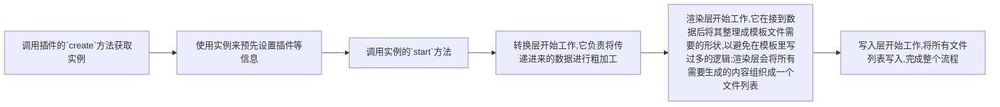

# swagger2apis 3.x

根据文档json快速生成api接口定义文件,从繁琐低级的工作中抽身,支持渐进式的引入.
降低沟通成本,后端更新接口文档>我们重新生成>后端的所有修改在git的diff下一目了然.

在3.x中我们只生产数据,而数据的消费方式完全由你来决定,这意味着更高的灵活性以及拓展性.

## 特性

- 根据 Swagger JSON 自动生成 `TypeScript` 接口定义和 API 函数,可通过插件编译为`javascript`
- 支持自定义模板,灵活控制生成的代码格式
- 支持插件系统可扩展功能,满足特殊需求
- 支持代码格式化,保持一致的代码风格
- 适配器模式,可以轻松集成到现有项目中
- 支持命名空间,避免命名冲突
- 类型安全,生成的代码包含完整的类型定义
- 支持tree-shaking
- 支持后端的中文字符定义

## 安装

```shell
npm i swagger2apis -D
# 或者
pnpm i swagger2apis -D
# 或者
yarn add swagger2apis -D
```

## 使用

最简单的方式是在你项目中任意位置新建一个脚本(最好是`mjs`后缀的文件,这样可以让这个脚本的模块系统独立于项目),以下是一个极简的示例:

```js
import path from "node:path";
import { __dirname_esm, create } from "swagger2apis";
// 通常情况下,你的json应该通过网络请求去获取,这里为了方便,所以直接使用静态文件
import swaggerJSON from "./json/swagger_2.json" assert { type: "json" };

const app = create(
  // 注意这里是一个对象,不是字符串
  swaggerJSON,
  {
    outdir: path.join(
      __dirname_esm(import.meta.url),
      // 这里实际上可以理解为命令空间
      "./BASE"
    ),
    // 敏感信息开关
    safe: false
  }
);
// 传入适配器导入地址,开始生成文件
app.start("../request.ts");
```

执行一下这个文件,你就会发现你的项目中多了一些文件,这些文件就是我们最终想获取的产物了.

在这个示例中,展示了最简易的常规用法.我们先使用`create`api创建了一个实例,然后调用了start并传入了[适配器](#关于适配器)的导入路径,如果没有特殊需求,其实这样就已经够用了.

再然后,我们展示一个复杂的示例,这个示例中我们使用到了插件系统,来完成一些特殊需求,我尽量在注释中佐以解释.

```js
import path from "node:path";
import {
  __dirname_esm,
  create,
  GroupRender,
  ENTRY_FILE_NAME,
  createCodeFormatterPlugin,
  createResponseWrapperPlugin,
  CleanDirPlugin,
  createCompileTS2JSPlugin
} from "swagger2apis";
// 通常情况下,你的json应该通过网络请求去获取,这里为了方便,所以直接使用静态文件
import swaggerJSON from "./json/swagger_2.json" assert { type: "json" };

const app = create(
  // 注意这里是一个对象,不是字符串
  swaggerJSON,
  {
    outdir: path.join(
      __dirname_esm(import.meta.url),
      // 这里实际上可以理解为命令空间
      "./ALLIN"
    ),
    // 敏感信息开关
    safe: false
  }
);

// 使用代码格式化插件,你可以传入项目中的代码格式化配置来保持代码风格统一
app.usePlugin(createCodeFormatterPlugin({}));

// 有些后端喜欢在外层包一层状态层,这个插件可以将响应标注也包裹一层状态层,你很可能需要根据你司后端的数据结构来进行调整
const ApiResponseWrapperName = "ApiResponseWrapper";
const ApiResponseWrapperType = `
declare interface ${ApiResponseWrapperName}<T>{
  data: T;
  success: boolean;
  code: string;
  msg: string;
}
`;
app.usePlugin(createResponseWrapperPlugin(ApiResponseWrapperName, ApiResponseWrapperType));

// 清理工作目录
app.usePlugin(CleanDirPlugin);

/**
 * 编译ts文件,(可选)你可以传入tsconfig和prettierConfig来灵活的调整编译配置,
 * 这个插件编译后,ts文件不会删除,因为个人觉得ts文件可以用来当做文档查看,所以没有进行删除
 * 如果你有删除ts文件的需求,可以自行写个插件来删除这些ts文件
 */
app.usePlugin(
  createCompileTS2JSPlugin(
    {
      baseUrl: "./",
      paths: {
        "@/*": ["./src/*"]
      }
    },
    {
      parser: "typescript",
      printWidth: 200,
      semi: true,
      singleQuote: false
    }
  )
);

// 如果你不希望将所有定义都放到一个文件中,可以使用GroupRender来进行分组渲染
const isGroupRender = true;
isGroupRender && app.cutstomRender(GroupRender);

// start不仅仅可以传入字符串,也可以传入一个函数,通过这个函数来灵活的实现适配器的导入
app.start((node) => {
  if (isGroupRender && node.fileName === ENTRY_FILE_NAME) {
    // 这里由于我们使用了GroupRender,主文件就不再需要导入适配器了
    return "";
  } else {
    return "import { adaptorFn } from './request.ts';";
  }
});
```

如果你的需求没有得到满足,你可以使用插件来完成你的需求,只要你的想象力够丰富,它是一定可以完成你的需求的,具体可以参考[插件系统](#插件系统简述)

你也可以联系wechat:pandavips,我会尽量帮助你实现自己的需求.

## 关于适配器

阅读这一块之前,希望你可以先去阅读下那些新生成的文件,放心,此举不费吹灰之力.你可以在代码中看到,我们生成的接口定义函数最终都会调用一个叫`adaptorFn`函数,并最终返回这个函数执行完毕后的结果.

它的作用是,将我们最终生成的函数桥接到你自己的请求函数上,这样我们就可以使用自己习惯的请求库来发送请求了.因为项目中的请求方式是多变的,这个工具没有办法做到适配任何人,任何项目的请求函数,这也是它出现的原因,有了它我们只需要做一些小小的工作,即可接入千奇百怪的请求函数.有了这个桥接层,我们还可以在项目中灵活的切换请求库,而不需要修改任何代码.

一个标准的,用来桥接请求函数的示例代码如下:

```js
import axios from 'axios'
export const adaptorFn = async (config: any) => {
  const res = await axios({
    url: config.url,
    method: config.method,
    // 为了规范,这里你可能需要区分axios`get`和`post`的参数名称,例如get我们使用params,post使用data
    data: config.params,
    headers: config.headers
  })
  return res.data
}
```

上边的例子我们直接使用了axios,但是你完全可以使用任何你喜欢的请求库,例如`fetch`等.更多的情况下,这里桥接的是你已经进行了封装的请求函数.

## 插件系统简述

没有实现你的最终需求?或许你需要使用插件来完成这些工作。该工具实现了一个mini的插件系统,以便于实现你的特殊需求。

请容我先用一个流程图来说明这个工具整个运作流程(不涉及自定义插件的影响下)：



我们清楚了这个流程更容易让我么理解插件的运行机制,我们的插件其实无非就是在这些声明周期之间插入我们自己的逻辑,所以我们理所当然的想到,我们的插件也应该会有生命周期的存在,是的:

```ts
export interface IPlugin {
  // 数据集进行转换前
  beforeTransform?: (context: IContext) => Promise<IContext> | IContext;
  // 数据集进行转换后
  afterTransform?: (context: IContext) => Promise<IContext> | IContext;
  // 数据进行渲染前
  befofeRender?: (context: IContext) => Promise<IContext> | IContext;
  // 数据进行渲染后
  afterRender?: (context: IContext) => Promise<IContext> | IContext;
  // 文件写入前
  beforeWriteFile?: (context: IContext) => Promise<IContext> | IContext;
  // 文件写入后
  afterWriteFile?: (context: IContext) => Promise<IContext> | IContext;
}
```

一个插件至少有一个或者更多的生命周期钩子才能称得上是一个插件.我们可以分别在关键节点使用插件的钩子来插入我们自己的逻辑,来干预最终的运行结果.你可能会好奇,为什么需要`xxxafter`和`xxxbefore`,难道不可以在关键节点之间放置一个钩子隔离即可吗?这样确实可以,但是我们还是细分了钩子,这样是为了在未来更好的让我们的逻辑放置到更清晰的层级.

下边就是一个插件,它的作用是在我们将ts编译为js后,删除掉原先ts文件的功能:

```js
// 删除ts文件插件
const DeleteTsFilePlugin = {
  afterWriteFile: async (ctx) => {
    const { writedFileList } = ctx;
    // 过滤出ts文件
    const tsFileList = writedFileList.filter((item) => item.endsWith(".ts") && !item.endsWith(".d.ts"));
    // 然后删除掉
    tsFileList.forEach((file) => {
      fs.unlinkSync(file);
    });
    return ctx;
  }
};
```

它使用了`afterWriteFile`钩子来完成了工作,并从`ctx`参数拿到关键数据完成了后续的工作.这个ctx你可以理解为全局上下文,插件每一个插件的生命周期都会接收到它,它是这样一个接口形状:

```ts
export interface IContext {
  // 传递进来的原始文档json
  rawJSON: any;
  // 插件集
  plugins: IPlugins;
  config: IConfig;
  // 设置渲染函数
  setRender: (renderFn: RednerFn) => void;
  // 转换层处理后的数据
  transformEdJson: {
    apis: ApiInfo[];
    interfaces: InterfaceInfo[];
    raw: any;
  };
  // 待渲染数据
  renderData: RenderData;
  // 最终渲染结果(待写入的文件列表)
  renderRes: RenderRes[];
  // 已经写入的文件path列表
  writedFileList: string[];
}
```

这样我们就很清楚的了解了插件的运行流程了,总结就是一个插件可以有多个生命周期钩子,他们会在关键节点插入我们自己的逻辑来完成需求.

目前插件还没有实现优先级,所以请注意插件的注册顺序,有时候你可能需要进行一些调整,抱歉.

你可以前往[这里](https://github.com/pandavips/swagger2apis/blob/main/packages/core/src/plugins/index.ts)查看所有插件的实现,来获得更多的灵感.

## 关于如何使用自己的模板

关于本项目使用的模板引擎,目前使用版本:3.1.1(几乎没有学习成本,模板引擎都大同小异):
<https://www.npmjs.com/package/eta>

默认项目模板位置(安装该包后,你可以将其复制出来继续自己的加工):`\node_modules\swagger2apis\dist\template`,
然后就是实现并设置自己的渲染器

```js
import { Eta } from "eta";
const MyRender = async (ctx) => {
  const { renderData } = ctx;
  const eta = new Eta({
    views: "你的模板文件夹路径"
  });
  return [
    {
      content: eta.render("./apis", renderData),
      extName: "ts",
      fileName: ENTRY_FILE_NAME
    },
    {
      content: eta.render("./interfaces", renderData),
      extName: "d.ts",
      fileName: "interfaces"
    }
  ];
};
app.cutstomRender(MyRender);
```

这样你就可以为所欲为的生成任意内容了.你也可以查看下[分组渲染器的实现](https://github.com/pandavips/swagger2apis/blob/main/packages/core/src/plugins/Render.ts),来获取更多灵感.

## 关于safemode

于请求本身的功能性无关,主要是避免了敏感信息被打包进最终产物,这在一些C端产品中需要留意.但是在一些不敏感的场景,我们可以开关这个选项来提供更多的数据,以便于我们拥有更多的拓展可能性.

## 一些建议

- 如果你有条件使用ts来跑这个工具,你应该毫不犹豫的选择使用ts;最大的好处是,你在写插件的时候,会获得更多的类型提示.
- 在项目中使用时我个人建议统一导入方式,例如`import * as Apis from '@/src/apis'`,这样的好处是,很明显就能看出这些函数出自哪里,方便后续的迁移或者工具升级,我们只需要在入口处做处理;同时它也符合构建工具`tree-shaking`优化逻辑

## 最后

`openapi3`的用户可以使用转换工具将文档json转换swagger2的格式,然后再尝试使用本工具.

我司内部使用的东西,所以可能出现没有覆盖到你的需求,以及未知的边缘case,如果出现的问题,欢迎提交issue或者pr.
